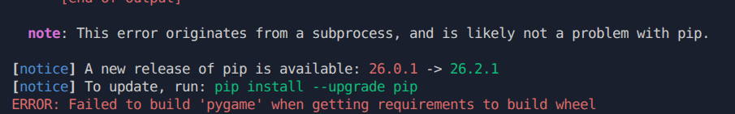

## Make a virtual environment

If you are on linux:

```bash
python3 -m venv venv
source venv/bin/activate
```

If you are on windows:

```bash
python -m venv venv
venv\Scripts\activate
```

## Install requirements

After activation of the virtual environment:

```bash
pip install -r pygame
```

Pygame should be installed and if you are on ubuntu or linux you might encounter this error:



All the sources suggest this is problem with the more recent versions of python. I got this error on a 3.14 environment. 

I downgraded to `3.12` and it worked.

Or if you dont want to downgrade, You can type installing the `pygame community edition`:

```bash
pip install pygame-ce
```

This installed properly in my python 3.14 environment.

Both libraries are largely indentical, So I dont think there would be any problem. Sometimes there might be some syntax differences but if you are using pygame-ce you can find the correct syntax in the official [documentation](https://pyga.me/docs/) or just one serach im google.

I'll be using `pygame-ce` going forward.

# Create a Pygame Window and respond to events

Make a new file named `main.py` and inside the file write the following:


```python 
import pygame


class Main():
    def __init__(self):
        # initialize pygame
        pygame.init()
        
        # set the screen
        self.screen = pygame.display.set_mode((1200, 800))
        pygame.display.set_caption("Space Defenders")
    
    def game_loop(self):
        
        # main game loop
        while True:

            # check for events
            for even in pygame.event.get():
                if even.type == pygame.QUIT:
                    quit()
            
            # fill the screen with the background color
            self.screen.fill(self.bg_color)
            

if __name__ == "__main__":
    app = Main()
    app.game_loop()
```


## Setting thhe background


```python
#main.py
...
        pygame.display.set_caption("Space Defenders")

        # general attributes
        self.bg_color = (0,255,171)
    
    def game_loop(self):
        
        # main game loop
        while True:

            # check for events
            for even in pygame.event.get():
                if even.type == pygame.QUIT:
                    quit()
            
            # fill the screen with the background color
            self.screen.fill(self.bg_color)

            ...

```

## Making a settings class to keep the general attributes


```python
# settings.py
class Settings:
    def __init__(self) -> None:
        self.screen_width = 1200
        self.screen_height = 800
        self.bg_color = (0, 255, 171)

```

Now we can, use this class in `main.py`

```python
#main.py

import pygame

from settings import Settings

class Main():
    def __init__(self):
        # initialize pygame
        pygame.init()
        
        # initialize settings
        self.settings = Settings()
        
        # set the screen, settings class update
        self.screen = pygame.display.set_mode((
            self.settings.screen_width,
            self.settings.screen_height
        ))
        pygame.display.set_caption("Space Defenders")

    
    def game_loop(self):
        
        # main game loop
        while True:

            # check for events
            for even in pygame.event.get():
                if even.type == pygame.QUIT:
                    quit()
            
            # fill the screen with the background color. settings update
            self.screen.fill(self.settings.bg_color)

            # update the screen
            pygame.display.flip()
            

if __name__ == "__main__":
    app = Main()
    app.game_loop()
```


## Loading A ship image

```python
#ship.py
from __future__ import annotations
from typing import TYPE_CHECKING
import pygame

if TYPE_CHECKING:
    from main import Main


class Ship:
    def __init__(self, game: Main):
        # get the game screen
        self.screen = game.screen
        self.screen_rect = game.screen.get_rect()
        
        # load the image
        self.image = pygame.image.load('resources/ship.png')
        self.image_rect = self.image.get_rect()
        
        # set the image position to the bottom center of the screen
        self.image_rect.midbottom = self.screen_rect.midbottom
        
        
    def blitme(self):
        self.screen.blit(self.image, self.image_rect)

```


```python
# main.py
        self.screen = pygame.display.set_mode((
            self.settings.screen_width,
            self.settings.screen_height
        ))
        
        # set the title
        pygame.display.set_caption("Space Defenders")

        # create the ship
        self.ship = Ship(self)

    
    def game_loop(self):
        
        # main game loop
        while True:

            # check for events
            for even in pygame.event.get():
                if even.type == pygame.QUIT:
                    quit()
            
            # fill the screen with the background color
            self.screen.fill(self.settings.bg_color)
            
            # call the blitme method to render the ship
            self.ship.blitme()

```

## Making the ship image smaller

```python
# ship.py
...
        self.image = pygame.image.load('resources/ship.png')
        # scalling down the image by 20%
        self.image = pygame.transform.scale_by(
            self.image,
            0.2
        )
        self.image_rect = self.image.get_rect()
        
        self.image_rect.midbottom = self.
...
```

## Refectoring the event checker

```python
#main.py
...
    def game_loop(self):
        
        # main game loop
        while True:

            # check for events
            self.check_events()
            
            # fill the screen with the background color
            self.screen.fill(self.settings.bg_color)
            
            self.ship.blitme()

            # update the screen
            pygame.display.flip()
    
    def check_events(self):
        for event in pygame.event.get():
            if event.type == pygame.QUIT:
                quit()
...
```

## Refactor the screen update

```python
#main.py
...
    def game_loop(self):
        
        # main game loop
        while True:

            # check for events
            self.check_events()
            # update the screen
            self.update_screen()
    
    def check_events(self):
        ....
                
    def update_screen(self):
        self.screen.fill(self.settings.bg_color)
        self.ship.blitme()
        pygame.display.flip()
...
```

## Ship movement

```python
#main.py
...
    def check_events(self):
        for event in pygame.event.get():
            if event.type == pygame.QUIT:
                quit()
                
            # check for key events
            elif event.type == pygame.KEYDOWN:
                if event.key == pygame.K_RIGHT:
                    # if the right arrow key is pressed
                    # move the ship to the right by 10 pixels
                    self.ship.image_rect.x += 10
...
```

# Continueous movement

```python
# ship.py
...
class Ship:
    def __init__(self, game: Main):
        self.moving_right = False
        self.moving_left = False
        
        ...
    
    def update(self):
        if self.moving_right:
            self.image_rect.x += 1
            
        if self.moving_left:
            self.image_rect.x -= 1
            
...
```

```python
# main.py
    def game_loop(self):
        # main game loop
        while True:

            # check for events
            self.check_events()
            self.ship.update()
            
            # update the screen
            self.update_screen()
    
    def check_events(self):
        for event in pygame.event.get():
            if event.type == pygame.QUIT:
                quit()
                
            #keydown check for left and right    
            elif event.type == pygame.KEYDOWN:
                if event.key == pygame.K_RIGHT:
                    self.ship.moving_right = True
                elif event.key == pygame.K_LEFT:
                    self.ship.moving_left = True

            #keyup check for left and right  
            elif event.type == pygame.KEYUP:
                if event.key == pygame.K_RIGHT:
                    self.ship.moving_right = False
                elif event.key == pygame.K_LEFT:
                    self.ship.moving_left = False
...
```

# Adjusting ship speed

```python
# settings.py

class Settings:
    def __init__(self) -> None:
        self.screen_width = 1200
        self.screen_height = 800
        self.bg_color = (0, 255, 171)
        
        #ship settings
        self.ship_speed = .5
```

```python
#ship.py

class Ship:
    def __init__(self, game: Main):
        
        self.moving_right = False
        self.moving_left = False
        
        # get the game object
        self.settings = game.settings
        
        ...
        
        self.x = float(self.image_rect.x)
        
    def update(self):
        if self.moving_right:
            # calculate the new x position
            self.x += self.settings.ship_speed
            
        if self.moving_left:
            # calculate the new x position
            self.x -= self.settings.ship_speed
        
        # update the rect of the image
        self.image_rect.x = self.x
        
...
```

## Limiting the ship movement

```python
# ship.py
...
    def update(self):
        # checking if the ship is moving right and if the right side of the ship is less than the right side of the screen
        if self.moving_right and self.image_rect.right < self.screen_rect.right:
            self.x += self.settings.ship_speed
        
        # checking if the ship is moving left and if the left side of the ship is greater than the left side of the screen
        if self.moving_left and self.image_rect.left > 0:
            self.x -= self.settings.ship_speed
            
        self.image_rect.x = self.x

...
```

## Refactor the key events

```python
# main.py

    def check_events(self):
        for event in pygame.event.get():
            if event.type == pygame.QUIT:
                quit()
                
            elif event.type == pygame.KEYDOWN:
                self._check_keydown_events(event)
                    
            elif event.type == pygame.KEYUP:
                self._check_keyup_events(event)
                    
    def _check_keydown_events(self, event):
        if event.key == pygame.K_RIGHT:
            self.ship.moving_right = True
        elif event.key == pygame.K_LEFT:
            self.ship.moving_left = True
            
    def _check_keyup_events(self, event):
        if event.key == pygame.K_RIGHT:
            self.ship.moving_right = False
        elif event.key == pygame.K_LEFT:
            self.ship.moving_left = 
            
...
```

## Press K to quit

```python
# main.py
...
    def _check_keydown_events(self, event):
        if event.key == pygame.K_RIGHT:
            self.ship.moving_right = True
        elif event.key == pygame.K_LEFT:
            self.ship.moving_left = True
            
        elif event.key == pygame.K_q:
            quit()

...
```


## Full screen mode

```python
# main.py

class Main():
    def __init__(self):
        # initialize pygame
        pygame.init()
        
        # initialize settings
        self.settings = Settings()
        
        # full screen mode
        self.screen = pygame.display.set_mode((0, 0), pygame.FULLSCREEN)
        self.settings.screen_width = self.screen.get_rect().width
        self.settings.screen_height = self.screen.get_rect().height
...
```
